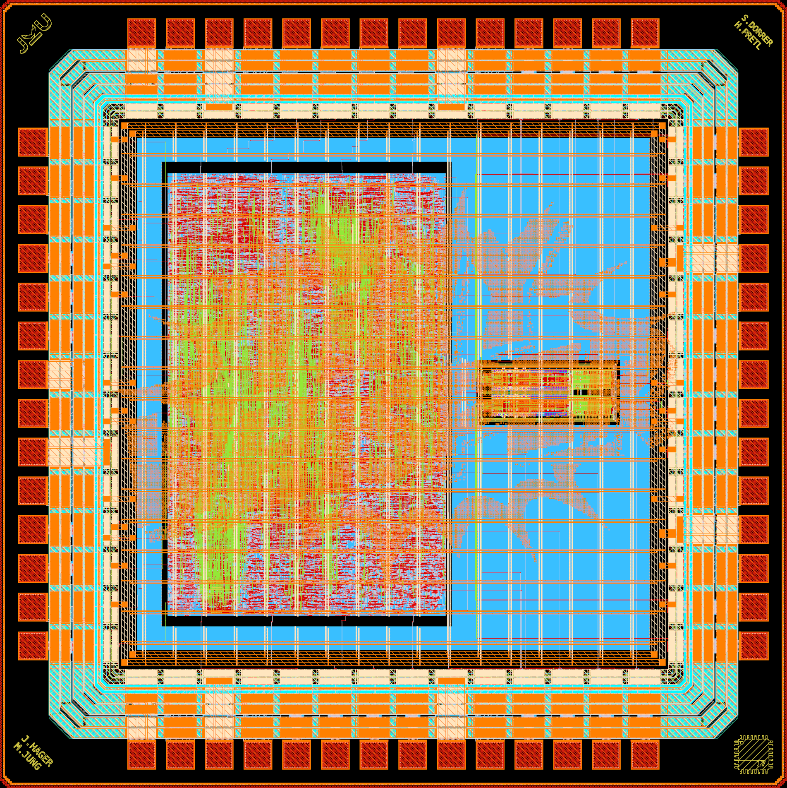
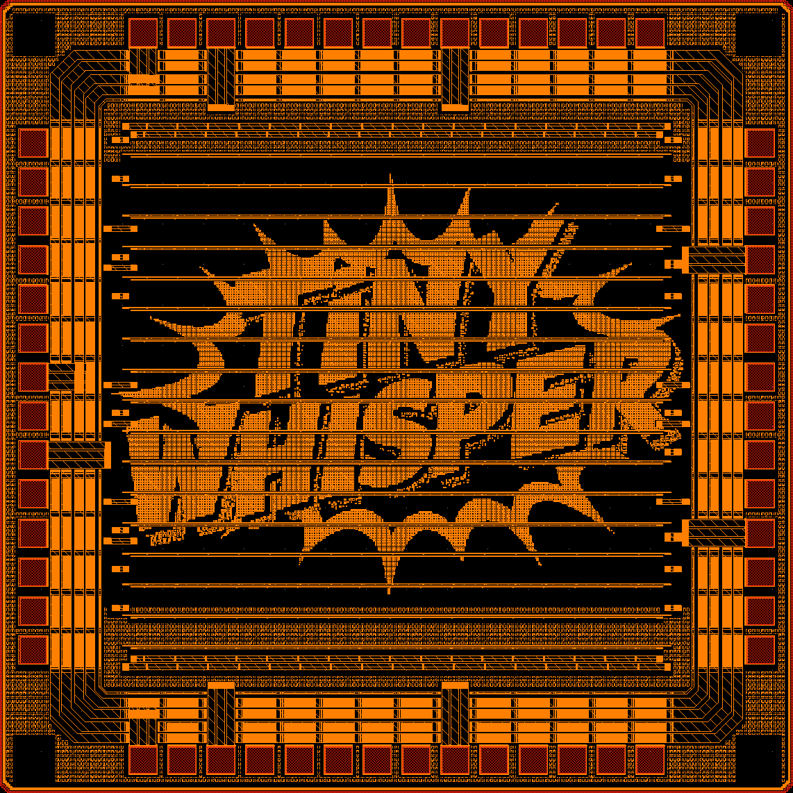
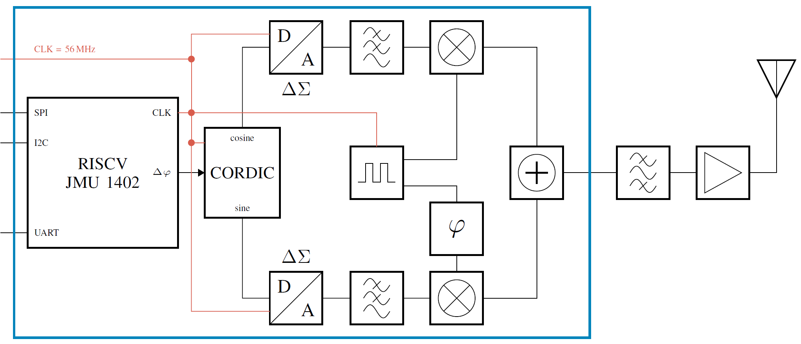

# TinyWhisper: An Open-Source Fully-Integrated Multi-Mode Short-Wave Transmitter for Amateur Radio Applications in 130-nm CMOS

(c) 2025-2026 Simon Dorrer (OE3SDE), Jonathan Hager (DK7JH), Matthias Jung (DL9MJ) and Harald Pretl

The full documentation of the TinyWhisper transmitter is available [here](doc/_site/index.html).

> [!IMPORTANT]
> This branch reflects the uncleaned repository state immediately after tapeout. This branch only freezes the tapeout state. Please use the `main` branch for further development.

> [!IMPORTANT]
> This repository requires the [IIC-OSIC-TOOLS](https://github.com/iic-jku/IIC-OSIC-TOOLS) container with tag `2026.04` or later.

<p align="center">
  <a href="doc/fig/tinywhisper_top_black.png">
    
  </a>
  <br>
  <em>Chip render of the ihp-sg13g2 TinyWhisper ASIC (2mm x 2mm).</em>
</p>

<p align="center">
  <a href="doc/fig/tinywhisper_top_black_TM2.png">
    
  </a>
  <br>
  <em>Render of the TopMetal2 TinyWhisper logo, generated with the tool ArtistIC.</em>
</p>

## Purpose

TinyWhisper demonstrates what is possible with current open-source tools and open-source PDKs, from system design to final tapeout, from packaging to PCB design, and even to a 3D-printed enclosure. It can also be used for:

- Ham radio courses
- University courses
- Regression tests of various open-source tools

## Chip Specifications

| Parameter           | Value                                                                             |
| ------------------- | --------------------------------------------------------------------------------- |
| Technology          | SKY130 \& IHP SG13G2 (130 nm CMOS)                                                |
| Die Area            | 2000 × 2000 µm (4 mm²)                                                            |
| Core Area           | 1270 × 1270 µm (1.613 mm²)                                                        |
| Clock Frequency     | 56 MHz                                                                            |
| Core Supply Voltage | 1.5 V                                                                             |
| I/O Supply Voltage  | 3.3 V                                                                             |
| Total Pads          | 56 (8 analog, 6 input, 9 output, 9 bidirectional, 7 VDD, 9 VSS, 3 IOVDD, 3 IOVSS) |
| Packaging           | QFN-48 package → 8 pads are connected directly to package VSS                     |
| Temperature Range   | -40 °C to +125 °C                                                                 |

## Overview

- Analog Front-End — IQ Modulator
    - 3rd-order multiple-feedback (MFB) low-pass filter
        - Butterworth
        - fc = 400 kHz
        - Barthelemy / Manfredini (B/M) inverter-based OTA
    - Passive CMOS voltage-mode mixer
        - Single-to-differential conversion circuit
        - Simple transmission-gate switch
- Digital Core
    - RISC-V CPU
        - SPI interface for external SRAM extension
        - I²C interface for external peripherals (I/O extender, display, keyboard, etc.)
        - UART interface for connection to PC / Raspberry Pi RP2040 + MicroPython
        - 8 × GPIOs (4 × inputs, one with external interrupt capability, and 4 × outputs)
    - 30-bit iterative CORDIC for sine / cosine generation
        - Adjustable amplitude
        - Adjustable fc, fm, and phim enable different modulation schemes
        - Frequency resolution: df = fclk / 2^(n) = fclk / 2^(30) ~ 0.05 Hz
        - Maximum frequency: fc = 2 × OSR × frequency / fclk
    - Delta-Sigma modulator
        - OSR = 32 / 64 / 128 / 256
        - 1st / 2nd order
        - Inversion / exchange of the I/Q channel
    - 25% LO Generation for Mixer
        - DIV = 1 / 2 / 4 / 8
        - Debugging modes (mixer TG always on / off → fully differential measurement of the MFB filter is possible)
    - Debugging features
        - Bidirectional pads: measure DSM / LO output or inject signals externally
        - Analog pads: inject analog IQ modulator signals externally

## Description

TinyWhisper is a compact WSPR transmitter realized with the ihp-sg13g2 PDK. The 2 mm x 2 mm chip operates at a core supply voltage of 1.5 V and an I/O supply voltage of 3.3 V. The chip is packaged in a QFN-48 package with a total of 56 pins, eight of which are VSS pins connected directly to the package VSS. The block diagram is shown below. A render of the final chip layout is shown above, with the digital part placed on the left side of the chip and the analog part on the right. A custom logo on the topmost metal layer, generated with the tool [ArtistIC](https://arxiv.org/abs/2502.02626), is also shown above.

<p align="center">
  <a href="doc/fig/tinywhisper_blockdiagramm.png">
    
  </a>
  <br>
  <em>Block diagram of the TinyWhisper ASIC and external RF circuitry.</em>
</p>

### Weak Signal Propagation Reporter
WSPR is a popular digital transmission scheme in amateur radio, specifically designed to study propagation conditions at low transmit power. WSPR transmits a short message containing the callsign, location, and transmit power using 4-FSK modulation (tone spacing 1.46 Hz, symbol duration 0.683 s). Thanks to strong forward error correction (rate 1/2), long ranges can be achieved even at very low transmit power levels (down to 10 mW). Receivers can decode WSPR signals down to -31 dB below the noise floor of a 2500 Hz channel. Received signals are reported to a central [database](https://www.wsprnet.org/drupal/wsprnet/map) via the internet, enabling global analysis of signal propagation.

### Digital Core
The heart of the digital core is a simple multi-cycle embedded processor based on a 32-bit RISC-V architecture running at a clock rate of 56 MHz. By using the RISC-V architecture, the CPU is directly compatible with common compilers, and programs can, for example, be written in C. The program is stored in an external SPI SRAM, from which the CPU fetches its instructions. For communication with peripherals, the chip features I2C and UART interfaces as well as digital GPIO pins that can be freely controlled.

An integrated 30-bit CORDIC algorithm generates the 4-FSK-modulated I/Q baseband signals according to the WSPR protocol. The phase increment of the CORDIC can be configured via software, allowing any frequency to be generated with a resolution of approximately 0.05 Hz. This also enables compensation for frequency errors of the external crystal oscillator. Using a second-order Delta-Sigma (DS) modulator with selectable oversampling (32, 64, 128, or 256), the parallel 30-bit data from the CORDIC is converted into a 1-bit signal that is passed directly to the analog front-end. Additionally, the digital core generates the LO frequencies listed in the table below by dividing the 56 MHz clock by two, covering the most common shortwave bands: 28 MHz, 14 MHz, 7 MHz, and 3.5 MHz.

| Band | RF Frequency  | LO Frequency | IF (CORDIC) |
| ---- | ------------- | ------------ | ----------- |
| 80m  | 3.592600 MHz  | 3.5 MHz      | 92.600 kHz  |
| 40m  | 7.038600 MHz  | 7 MHz        | 38.600 kHz  |
| 20m  | 14.095600 MHz | 14 MHz       | 95.600 kHz  |
| 10m  | 28.124600 MHz | 28 MHz       | 124.600 kHz |

### Analog Front-End
The analog front-end is an IQ modulator consisting of two third-order multiple-feedback (MFB) low-pass filters with a cutoff frequency of 400 kHz and a Butterworth characteristic. The amplifier core of the MFB filter is based on a Barthelemy / Manfredini (B/M) inverter-based OTA. Two passive voltage-mode mixers are driven by a 25% duty-cycle local oscillator and produce a single-ended RF output signal.

Integrated SPDT switches allow switching between the internal CORDIC/DSM signals and external analog inputs, enabling tests with an external function generator, among other uses.

Since the analog front-end is an IQ modulator, it supports not only WSPR but also other modulation schemes such as FT8, SSB, and CW. Hence, the title "TinyWhisper: An Open-Source Fully-Integrated Multi-Mode Short-Wave Transmitter for Amateur Radio Applications in 130-nm CMOS".

### Outlook
The chip is still in production and is expected to be delivered in December 2026. The ASIC is just the beginning of a broader open-hardware project. The next step is to design a PCB that includes all necessary external components: switchable bandpass filters for each RF band, an RF amplifier, a crystal oscillator as the clock source, external SRAM, voltage regulators for the various supply voltages, a display, controls, an SMA connector for the antenna, and a USB interface for configuration. The packaged chip will be soldered onto this board and then characterized.

Building on this PCB, a compact, 3D-printable enclosure is planned that accommodates the board together with a small battery and is robust enough for outdoor use during field tests and SOTA activations.

## IHP130 (ihp-sg13g2) PDK

- [x] Padframe & setup using the following template: https://github.com/IHP-GmbH/ihp-sg13g2-librelane-template

- Analog Front-End — IQ Modulator
    - [x] Filter Design with `Python`
        - [ ] Add fourth-order model for OTA impact
    - [x] Inverter-Based OTA Transistor gm/ID Sizing with `Jupyter` Notebook
    - [x] Circuit Design with `Xschem` and `Ngspice`
    - [x] Process Variation & Mismatch Simulation with `CACE`
    - [ ] Harmonic Balance (HB) Simulation with `VACASK`
    - [x] Layout with `KLayout` (LVS, DRC, PEX)
    - [x] Post-Layout Simulation
- Digital Core
    - [x] Digital Design of RISC-V CPU with `(System)Verilog`
    - [x] Gate-Level testbench with `cocotb`
    - [x] Layout of Digital Core with `LibreLane`
- [x] Analog Mixed-Signal Gate-Level Simulation including Padframe with `Xschem`, `Xspice` and `Ngspice`
- [x] Layout of TinyWhisper Transmitter (Padframe + Logos + Digital Core + IQ Modulator) with `LibreLane`
- [ ] Analog Mixed-Signal Post-Layout Simulation including Padframe with `Xschem`, `Spice` and `Ngspice` (--> convergence issues --> see issue https://github.com/IHP-GmbH/IHP-Open-PDK/issues/921)

## SKY130 (sky130A) PDK

- Analog Front-End — IQ Modulator
    - [x] Filter Design with `Python`
    - [x] Circuit Design with `Xschem` and `Ngspice`
    - [x] Process Variation & Mismatch Simulation with `CACE`
    - [x] Layout with `Magic` (LVS, DRC, PEX)
    - [x] Post-Layout Simulation
- Digital Core
    - [x] Digital Design of RISC-V CPU with `(System)Verilog`
    - [ ] Layout of Digital Core with `LibreLane`
- [ ] Analog Mixed-Signal Gate-Level Simulation with `Xschem`, `Xspice` and `Ngspice`
- [ ] Layout of TinyWhisper Transmitter (Digital Core + IQ Modulator)
- [ ] Analog Mixed-Signal Post-Layout Simulation with `Xschem`, `Spice` and `Ngspice`

## Tapeouts

- [x] TinyWhisper Transmitter (Digital Core + IQ Modulator) — IHP130: https://github.com/iic-jku/TinyWhisper/tree/IHP-TO-2026-03/ihp130/gds
- [x] RISC-V CPU — GF180 wafer.space: https://github.com/iic-jku/gf180mcu-jku-projects
- [x] WSPR in Hardware without RISC-V CPU (see [archive](https://github.com/iic-jku/TinyWhisper/tree/IHP-TO-2026-03/sky130/verilog/archive/verilog_TT_11-2025) folder) — SKY130 Tiny Tapeout: https://tinytapeout.com/chips/ttsky25b/tt_um_cejmu_wspr
- [x] IQ Modulator — SKY130 Tiny Tapeout: https://tinytapeout.com/chips/ttsky25b/tt_um_TinyWhisper

## Cite This Work

```
@software{2026_TinyWhisper,
	author = {Dorrer, Simon and Hager, Jonathan and Jung, Matthias and Pretl, Harald},
	month = apr,
    year = {2026},
	title = {{GitHub Repository for TinyWhisper: An Open-Source Fully-Integrated Multi-Mode Short-Wave Transmitter for Amateur Radio Applications in 130-nm CMOS}},
	url = {https://github.com/iic-jku/TinyWhisper}
}
```

## Acknowledgements

This project is funded by the JKU/SAL [IWS Lab](https://research.jku.at/de/projects/jku-lit-sal-intelligent-wireless-systems-lab-iws-lab/), a collaboration of [Johannes Kepler University](https://jku.at) and [Silicon Austria Labs](https://silicon-austria-labs.com).

<p align="center">
  <a href="https://silicon-austria-labs.com" target="_blank">
    
  </a>
</p>