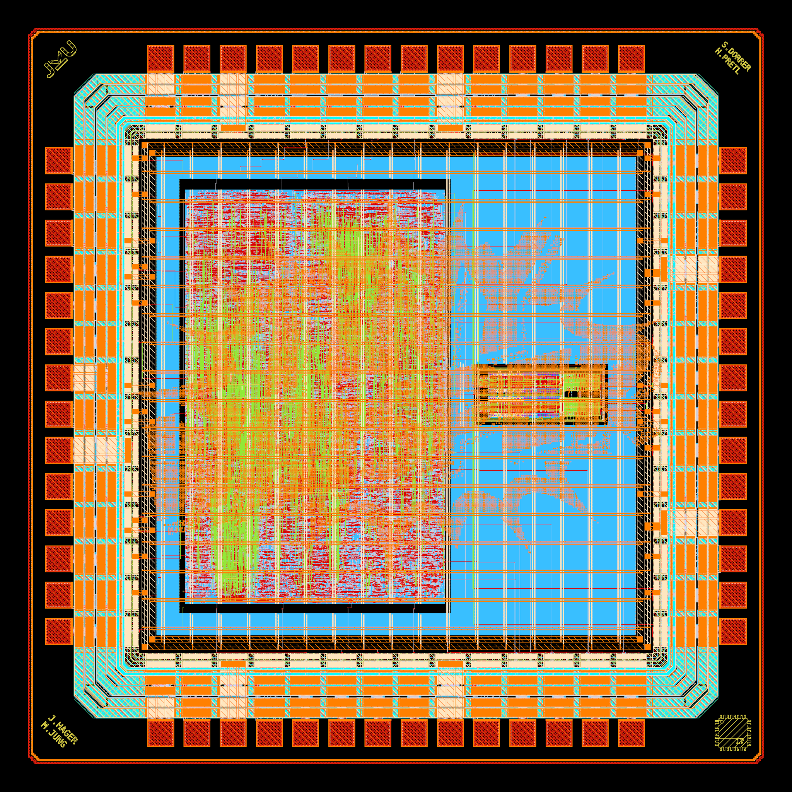

# ihp-sg13g2 TinyWhisper

> [!IMPORTANT]
> This repository requires the [IIC-OSIC-TOOLS](https://github.com/iic-jku/IIC-OSIC-TOOLS) container with tag `2026.04` or later.

<p align="center">
  <a href="img/tinywhisper_top_black.png">
    
  </a>
  <br>
  <em>Chip render of the ihp-sg13g2 TinyWhisper ASIC (2mm x 2mm).</em>
</p>

## Prerequisites

First, install LibreLane by following the Nix-based installation instructions: https://librelane.readthedocs.io/en/latest/installation/nix_installation/index.html

This repository contains a Nix flake that provides a shell with the [`dev`](https://github.com/librelane/librelane/tree/dev) branch of LibreLane.
To install the PDK, enable a Nix shell using `nix-shell` from the root of this repository and run `make clone-pdk`.

## Implement the Design

> [!NOTE]
> If you aren't in the Nix shell, run `nix-shell` from the root of this repository.

With this shell enabled, run the implementation:

```sh
make librelane
```

Additional targets are available for different DRC configurations:

- `make librelane-nodrc` – run LibreLane without DRC checks
- `make librelane-magicdrc` – run LibreLane with only Magic DRC checks
- `make librelane-klayoutdrc` – run LibreLane with only KLayout DRC checks

These targets are also available for the digital macros. After the LibreLane flow has completed successfully, the `final/` folder from the latest run is copied to the root directory of the repository.

## View the Design

After completion, you can view the design using the OpenROAD GUI:

```sh
make librelane-openroad
```

Or using KLayout:

```sh
make librelane-klayout
```

These commands are also available for the digital macros.

## Copying important Reports to the Reports Folder

To copy yosys, antenna violations, DRC errors, hold & setup timing and manufacturability reports of the latest run to the `reports/` folder in the root directory of the repository, run the following command:

```sh
make copy-reports
```

This will only work if the last run was completed without errors. This command is also available for the digital macros.

## Copying the final GDS to the GDS Folder

To copy and compress your latest GDS in the `final/` folder in the root directory of the repository and save it in the `gds/` folder, run the following command:

```sh
make copy-gds
```

This will only work if the last run was completed without errors.

## Render Layout of the Design

To render your latest GDS in the `final/` folder in the root directory of the repository and save it in the `img/` folder, run the following command:

```sh
make render-image
```

This will only work if the last run was completed without errors. This command is also available for the digital macros.

## Build Bondpad

To build the bondpad in the `ip` folder, run the following command:

```sh
make build-bondpad
```

## Build Logos

To build the logos in the `ip` folder, run the following command:

```sh
make build-logos
```

## Build Macros

To build a specific macro, look into the `Makefile` and run the corresponding command. To build all macros, run the following command:

```sh
make build-all-macros
```

### Build Digital Macros

The following command builds the `riscv` digital macro:

```sh
make build-riscv
```

For each digital macro the following commands are executed: `make librelane`, `make copy-reports`, and `make render-image`.

### Build Analog Macros

Each analog macro has its own `verify-top` target that runs LVS, DRC, and PEX for the top level cell.

To build the IQ modulator macro:

```sh
make build-iqmod
```

All analog macros are included in `build-all-macros` alongside the digital macros.

## Build All

To clone the PDK, build the bondpad and logos, build all macros, run LibreLane for the top-level chip, copy its reports, copy and ZIP its GDS, render its GDS, and display it in the OpenROAD GUI, run the following command:

```sh
make build-all
```

This is especially useful for people who want to rebuild our chip from scratch. Just clone this repo, run `nix-shell` in the root of this repository and run `make build-all`. Enjoy. :-)

## Verification and Simulation

We use [cocotb](https://www.cocotb.org/), a Python-based testbench environment, for the verification of the chip.
The underlying simulator is Icarus Verilog (https://github.com/steveicarus/iverilog).

The testbench is located in `cocotb/tinywhisper_top_tb.py`. To run the RTL simulation, run the following command:

```sh
make sim
```

To run the GL (gate-level) simulation, run the following command:

```sh
make sim-gl
```

> [!NOTE]
> You need to have the latest implementation of your design in the `final/` folder.

In both cases, a waveform file will be generated under `cocotb/sim_build/tinywhisper_top.fst`.
You can view it using a waveform viewer, for example, [GTKWave](https://gtkwave.github.io/gtkwave/).

```sh
make sim-view
```

These commands are also available for the digital macros.

## Verification

Independent verification targets are available for LVS, DRC, and PEX.

### LVS

Export the LVS netlist from Xschem and run LVS:

```sh
make lvs
```

To only export the netlist:

```sh
make lvs-netlist
```

You can optionally set the engineering value precision (default: 5):

```sh
make lvs-netlist EV_PRECISION=5
```

### DRC

Run a minimum pre-check DRC:

```sh
make drc-minimum
```

Run a regular DRC:

```sh
make drc-regular
```

### PEX

Run parasitic extraction:

```sh
make pex
```

You can set the extraction mode (default: 2):

```sh
make pex PEX_MODE=2
```

### Full Verification

To run LVS, regular DRC, and PEX in one step:

```sh
make verify-top
```

### Build and Verify

To build the whole chip and then verify it:

```sh
make all
```
