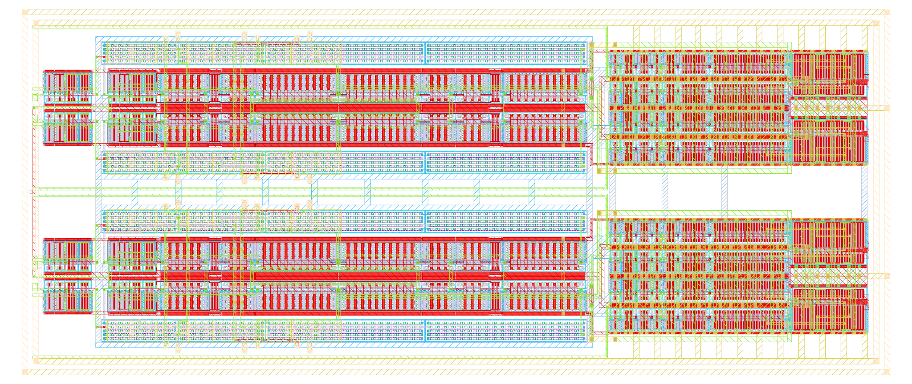

# ihp-sg13g2 IQ-Modulator

> [!IMPORTANT]
> This repository requires the [IIC-OSIC-TOOLS](https://github.com/iic-jku/IIC-OSIC-TOOLS) container with tag `2026.04` or later.

<p align="center">
  <a href="img/iqmod_top_white.png">
    
  </a>
  <br>
  <em>Render of the ihp-sg13g2 RISC-V layout (337um x 142um).</em>
</p>

## Verification and Simulation

All verification targets accept an optional `CELL=<cellname>` parameter to specify which subcell to verify. The default is the top-level cell (`iqmod_top`).

```sh
make <target> [CELL=<cellname>] [PEX_MODE=<1|2|3>] [EV_PRECISION=<digits>]
```

## Run CACE Simulations

Runs [CACE](https://github.com/efabless/cace) characterization simulations for the LPF and OTA core, collecting result plots into `cace/results/`. Each CACE YAML is invoked with its AC parameter sets (mismatch, Monte Carlo, corner sweep), the generated plots are copied, and temporary run artifacts are cleaned up:

```sh
make run-cace
```

Result plots are saved to:
- `cace/results/iqmod_mfb_lpf/` — closed-loop gain, CMRR, and unity-gain frequency plots
- `cace/results/iqmod_mfb_lpf_ota_core/` — open-loop gain, CMRR, and unity-gain frequency plots

## Export LVS Netlist

Exports the LVS netlist from Xschem and places it in `verification/lvs/`.

The `EV_PRECISION` parameter sets the number of significant digits used by Xschem's `ev` function when calculating device properties (default: 5). Increase this to avoid LVS mismatches caused by floating-point rounding differences between Xschem and KLayout (see [xschem#465](https://github.com/StefanSchippers/xschem/issues/465)).

```sh
make lvs-netlist
make lvs-netlist CELL=iqmod_mixer
make lvs-netlist EV_PRECISION=5
```

## Layout Versus Schematic (LVS)

Exports the schematic netlist from Xschem (via `lvs-netlist`), then runs KLayout LVS using `run_lvs.py` from the IHP Open-PDK. Compares the GDS layout in `klayout/` against the schematic netlist in `verification/lvs/`. Reports are saved to `verification/lvs/reports/`.

The `IGNORE_TOP_PORTS` flag tells KLayout LVS to ignore top-level port mismatches (default: 0, disabled). This is useful when verifying subcells whose top-level ports don't match the layout extraction.

```sh
make lvs
make lvs CELL=iqmod_mixer
make lvs EV_PRECISION=5
make lvs CELL=iqmod_mixer IGNORE_TOP_PORTS=1
```

## Design Rule Check (DRC)

Runs KLayout DRC using `run_drc.py` from the IHP Open-PDK. Checks the GDS layout in `klayout/`. Reports are saved to `verification/drc/reports/`.

```sh
make drc
make drc CELL=iqmod_mixer
```

## Parasitic Extraction (PEX)

Runs parasitic extraction using `sak-pex.sh` (Magic VLSI). The GDS is read from `klayout/` and the extracted SPICE netlist is written to `verification/pex/`.

The `PEX_MODE` parameter selects the extraction mode (default: 2):
- `1` = C-decoupled
- `2` = C-coupled (default)
- `3` = full-RC

If a matching Xschem symbol (`xschem/<CELL>_pex.sym`) exists, the `.subckt` pin order in the extracted SPICE file is automatically reordered to match the symbol's pin positions (top → first, bottom → last). This ensures the PEX netlist can be used directly with the corresponding Xschem symbol for simulation.

```sh
make pex
make pex CELL=iqmod_mixer
make pex CELL=iqmod_mixer PEX_MODE=3
```

## Verify a Specific Cell

Runs LVS, DRC, and PEX for a specific cell. The optional `IGNORE_TOP_PORTS` flag is forwarded to the LVS step:

```sh
make verify-cell CELL=iqmod_mixer
make verify-cell CELL=iqmod_mixer IGNORE_TOP_PORTS=1
```

## Verify All Subcells

Runs `verify-cell` for all subcells with finished layouts in `klayout/`, then runs `verify-top` for the top-level cell:

```sh
make verify-all
```

Currently verified subcells:
- `iqmod_mfb_lpf_ota_core_spdt_switch_inv`
- `iqmod_mfb_lpf_ota_core_spdt_switch_tg`
- `iqmod_mfb_lpf_ota_core_spdt_switch`
- `iqmod_mfb_lpf_ota_core_tg`
- `iqmod_mfb_lpf_ota_core_inv_NF6`
- `iqmod_mfb_lpf_ota_core_inv_NF10`
- `iqmod_mfb_lpf_ota_core_inv_NF20`
- `iqmod_mfb_lpf_ota_core_hybrid_bm`
- `iqmod_mfb_lpf_R1`
- `iqmod_mfb_lpf_R2`
- `iqmod_mfb_lpf_R3`
- `iqmod_mfb_lpf_R4`
- `iqmod_mixer_se2diff_tg_NF6`
- `iqmod_mixer_se2diff_inv_NF2`
- `iqmod_mixer_se2diff_inv_NF6`
- `iqmod_mixer_se2diff_inv_NF18`
- `iqmod_mixer_se2diff_inv_NF54`
- `iqmod_mixer_se2diff`
- `iqmod_mixer_tg`
- `iqmod_mixer`

## Verify Top Cell

Runs LVS, DRC, and PEX for the top cell:

```sh
make verify-top
```

## Verilog Stub

Generates a Verilog stub (`final/vh/<TOP>.v`) for top-level integration into the LibreLane flow. The pin names are hardcoded and all ports are declared as `inout`. After writing the stub, the target performs a bidirectional check against the PEX netlist (`verification/pex/<TOP>_pex.spice`) to ensure both pin sets match:

```sh
make verilog
```

## Export LEF

Exports a LEF file (`final/lef/<TOP>.lef`) from the top-level KLayout GDS using Magic with the `-hide` option:

```sh
make lef
```

## Copy GDS

Copies the top-level KLayout GDS from `klayout/` to `final/gds/`:

```sh
make copy-gds
```

## LIB

Generates a Liberty timing library (`final/lib/<TOP>.lib`) with default threshold settings for the top-level cell:

```sh
make lib
```

## Render Layout of the Design

Renders the top-level GDS layout and saves it in the `img/` folder:

```sh
make render-image
```

## Build Top Cell

Builds the top-level cell deliverables: Verilog stub generation, LEF export, LIB generation, GDS copy, and image rendering:

```sh
make build-top
```

## Build All

Builds the complete analog macro by first verifying all subcells (`verify-all`), then building the top-level cell (`build-top`):

```sh
make all
```
