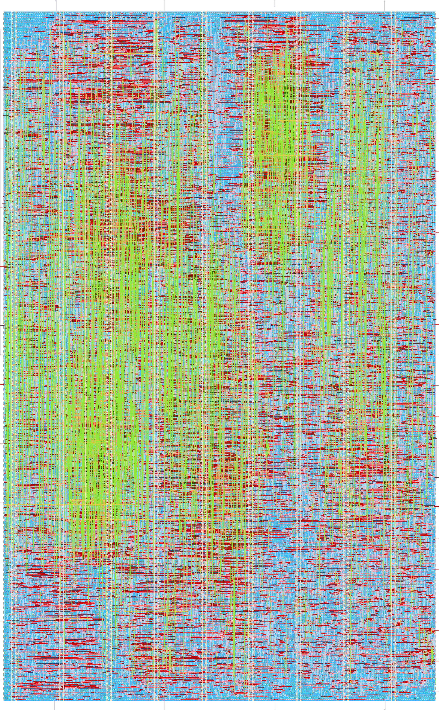

# ihp-sg13g2 RISC-V CPU

<p align="center">
  <a href="render/img/riscv_top_white.png">
    
  </a>
  <br>
  <em>Render of the ihp-sg13g2 RISC-V layout (700um x 1130um).</em>
</p>


## Directory Structure

<details>
<summary>Show Directory Structure</summary>

```text
📁 riscv/
├─ 📁 final/
│  ├─ 📁 gds/
│  │  └─ riscv_top.gds
│  ├─ 📁 lef/
│  │  └─ riscv_top.lef
│  ├─ 📁 lib/
│  │  ├─ 📁 nom_fast_1p32V_m40C/
│  │  ├─ 📁 nom_fast_1p65V_m40C/
│  │  ├─ 📁 nom_slow_1p35V_125C/
│  │  ├─ 📁 nom_typ_1p20V_25C/
│  │  └─ 📁 nom_typ_1p50V_25C/
│  ├─ 📁 nl/
│  │  └─ riscv_top.nl.v
│  ├─ 📁 pnl/
│  │  └─ riscv_top.pnl.v
│  ├─ 📁 spef/
│  │  └─ 📁 nom/
│  └─ 📁 vh/
│     └─ riscv_top.vh
├─ 📁 flow/
│  └─ 📁 librelane/
│     ├─ config.yaml
│     ├─ impl.sdc
│     ├─ pin_order.cfg
│     └─ signoff.sdc
├─ 📁 fpga/
│  ├─ 📁 arch/                # one fragment per FPGA architecture (ice40, ecp5)
│  ├─ 📁 icebreaker/          # per-board Makefile (device, programmer) and pin constraints
│  ├─ 📁 pico-ice/
│  ├─ 📁 ulx3s/
│  ├─ Makefile                # dispatcher, selects the board with BOARD=
│  ├─ dut.mk                  # RTL sources shared by all boards
│  ├─ fpga.mk                 # the shared flow
│  └─ README.md
├─ 📁 netlist/
│  ├─ 📁 nl/
│  │  └─ riscv_top.nl.v
│  ├─ 📁 pex/
│  │  ├─ riscv_top_klayout_pex_*.spice
│  │  └─ riscv_top_magic_pex_*.spice
│  ├─ 📁 pnl/
│  │  └─ riscv_top.pnl.v
│  ├─ 📁 spice/
│  │  └─ riscv_top.spice
│  └─ 📁 xspice/
│     └─ riscv_top.xspice
├─ 📁 render/
│  ├─ 📁 blender/
│  └─ 📁 img/
│     ├─ riscv_top_black.png
│     ├─ riscv_top_librelane.png
│     └─ riscv_top_white.png
├─ 📁 rtl/
│  ├─ 📁 matlab/
│  │  ├─ dec2frac.m
│  │  ├─ getCordicScaling.m
│  │  ├─ getRotationAngles.m
│  │  ├─ iterative_cordic_main.m
│  │  ├─ sfixed_qa.m
│  │  └─ unsigned2bin.m
│  ├─ alu.sv
│  ├─ constants.sv
│  ├─ control.sv
│  ├─ cordic_iterative.v
│  ├─ cordic_slice.v
│  ├─ csr.sv
│  ├─ dsmod.v
│  ├─ freq_generator.sv
│  ├─ i2c_master.sv
│  ├─ i2c_master_mc.sv
│  ├─ imm_gen.sv
│  ├─ instructioncounter.sv
│  ├─ lo_gen.v
│  ├─ memory.sv
│  ├─ regs.sv
│  ├─ riscv_top.sv
│  ├─ spi_master.sv
│  ├─ sram_sim.sv
│  ├─ uart_rx.v
│  └─ uart_tx.v
├─ 📁 schematic/
│  └─ 📁 xschem/
│     ├─ riscv_top.sym
│     ├─ riscv_top_pex.sym
│     └─ xschemrc
├─ 📁 scripts/
│  ├─ check_pex_ports.py
│  ├─ spi2xspice.py
│  └─ verilog2sym.py
├─ 📁 testbenches/
│  ├─ 📁 cocotb/
│  │  ├─ 📁 dsmod/
│  │  │  ├─ Makefile
│  │  │  └─ README.md
│  │  └─ 📁 riscv_top/
│  │     ├─ riscv_top_tb.gtkw
│  │     ├─ riscv_top_tb.py
│  │     └─ riscv_top_tb.surf.ron
│  ├─ 📁 verilog/
│  │  ├─ 📁 dsmod/
│  │  │  ├─ dsmod_tb.v
│  │  │  ├─ dsmod_tb.gtkw
│  │  │  └─ dsmod_tb.surf.ron
│  │  └─ 📁 riscv_top/
│  │     ├─ riscv_top_tb.sv
│  │     ├─ riscv_top_tb.gtkw
│  │     └─ riscv_top_tb.surf.ron
│  └─ 📁 xschem/
│     ├─ riscv_top_tb_tran.sch
│     └─ xschemrc
├─ 📁 verification/
│  ├─ *.rpt
│  └─ stat.rpt
├─ Makefile
└─ README.md
```

</details>


## Makefile Targets

### Show Available Targets

The default Make target is `help`, so running `make` prints usage and all available targets with short descriptions.

```sh
make
make help
```


### Open the Design Files

Opens a file browser for this folder with `sak-open.py` from the [IIC-OSIC-TOOLS](https://github.com/iic-jku/IIC-OSIC-TOOLS), one button per design file, grouped by directory:

```sh
make open
```

Clicking a button launches the matching tool in the file's own directory, so Xschem finds its `simulations/` folder and KLayout its run outputs where they belong:

| File type | Tool |
| --- | --- |
| `.sch`, `.sym` | Xschem |
| `.gds`, `.gds.gz`, `.oas`, `.oas.gz` | KLayout in edit mode |
| `.mag` | Magic |
| `.vcd`, `.fst`, `.gtkw` | GTKWave |
| `.raw` | gaw (ngspice rawfile) |
| `.png`, `.pdf` | the desktop's handler (`xdg-open`) |
| `.sv`, `.svh`, `.v`, `.vh`, `.vhd`, `.vhdl`, `.spice`, `.cir`, `.sp`, `.cdl`, `.sdc`, `.lef`, `.lib`, `.tcl`, `.mk`, `.yaml`, `.json`, `.py`, `.qmd`, `.tex`, `.md` and `Makefile` | gvim |

Only these types get a button. Files with any other extension (`.sh`, `.svg`, `.pcf`, `.save`, `.rpt`, `.txt`, `.csv` and so on) are not listed.

Schematics and symbols that belong to one design unit share a single tabbed Xschem instance instead of one process per click. The unit is the nearest ancestor holding a `Makefile`, so this macro gets its own instance and every tab writes its netlists to the folder this macro's `xschemrc` pins, see [Xschem Configuration](../../README.md#xschem-configuration).

The tree is rescanned every 15 s, so files a running flow produces appear on their own and are highlighted for a minute. Generated directories are skipped by default: `runs/`, `sim_build/`, `obj_dir/`, `simulations/`, `__pycache__/`, `_freeze/` and `.git/`. The Xschem `simulations/` folder is one of them, so the `.raw` files show up only with `--all`. Pass extra options with `OPEN_ARGS`:

```sh
make open OPEN_ARGS=--all              # include the build outputs
make open OPEN_ARGS="--prune backups"  # skip one more directory name
```

At most 400 buttons are drawn at once, because each one is an X window, and what is left out is stated at the end of the list. That cap is easy to hit with `--all`, which pulls in the LibreLane run directories and every simulation output of this macro. Narrow it with `--prune` when that happens.

> [!NOTE]
> This target needs a display. Run it inside the container's VNC/noVNC desktop or over X11 forwarding. In a shell-only container it stops with `cannot open a window`. The `.png` and `.pdf` buttons hand the file to the desktop's registered handler, so those two need the full VNC/noVNC session and do not work over a bare X forward.


### Linting

To lint the Verilog/SystemVerilog source files with [Verilator](https://www.veripool.org/verilator/), run:

```sh
make lint-verilog              # lint the full riscv_top design
make lint-verilog CELL=dsmod   # lint a single module
make lint-verilog-all          # lint dsmod, cordic_iterative, lo_gen, and riscv_top
```

When `CELL=riscv_top` (the default), `constants.sv` and the full `MODULES_SYNTH` source list (all synthesis sources, without the simulation-only `sram_sim.sv`) are passed to Verilator.
For a single cell, the correct extension (`.sv` or `.v`) is detected automatically, and `constants.sv` is always included first so opcode and funct constants are in scope.

The `lint-verilog-all` target runs these lint checks in sequence:

1. `make lint-verilog CELL=dsmod`
2. `make lint-verilog CELL=cordic_iterative`
3. `make lint-verilog CELL=lo_gen`
4. `make lint-verilog` (default: `riscv_top`)

This is also the lint step used by `make all`.


### Verification and Simulation

We use [cocotb](https://www.cocotb.org/), a Python-based testbench environment, and [Icarus Verilog](https://github.com/steveicarus/iverilog) for the verification of the macro.

The simulation targets are unified and accept an optional `CELL` variable (default: `riscv_top`).
The waveform viewer can be changed with `WAVEFORM_VIEWER=<gtkwave|surfer>` (default: `gtkwave`).

#### RTL Verilog Simulation

Compiles the RTL with Icarus Verilog and runs the simulation.
When `CELL=riscv_top` (the default), the full `MODULES_SIM` source list (`constants.sv`, all synthesis sources and `sram_sim.sv`) is used and `testbenches/verilog/riscv_top/riscv_top_tb.sv` is picked up.
For non-top cells, the RTL source is auto-selected as `rtl/<CELL>.sv` when present, otherwise `rtl/<CELL>.v`, and the testbench likewise as `testbenches/verilog/<CELL>/<CELL>_tb.sv` when present, otherwise `testbenches/verilog/<CELL>/<CELL>_tb.v`.
The waveform is written to `testbenches/verilog/<CELL>/` (e.g. `testbenches/verilog/riscv_top/riscv_top_tb.vcd`):

```sh
make sim-rtl-verilog              # run riscv_top RTL simulation
make sim-rtl-verilog CELL=dsmod   # run dsmod RTL simulation
```

To view the waveform afterwards:

```sh
make sim-view-verilog                                          # view riscv_top waveform
make sim-view-verilog CELL=dsmod                               # view dsmod waveform
make sim-view-verilog CELL=dsmod WAVEFORM_VIEWER=surfer        # use Surfer instead
```

Each simulation folder contains a pre-configured waveform layout file (`<CELL>_tb.gtkw` for GTKWave, `<CELL>_tb.surf.ron` for Surfer).
The view target loads it automatically together with the current `.vcd`, so signal formatting is preserved across runs.

#### RTL / GL cocotb Simulation

The cocotb testbenches are located in `testbenches/cocotb/`.
For `CELL=dsmod`, the simulation delegates to the sub-Makefile in `testbenches/cocotb/dsmod/` (PSD, SNDR sweep, and ramp tests).
For all other cells the Python runner is invoked directly.

```sh
make sim-rtl-cocotb                                    # run riscv_top RTL cocotb simulation
make sim-rtl-cocotb CELL=dsmod                         # run the dsmod suite for the baseline ORDER=2 / OSR=64
make sim-rtl-cocotb CELL=dsmod DSMOD_TARGET=all_runs   # run the dsmod suite for all orders and OSRs
```

`DSMOD_TARGET` selects which target of the dsmod sub-Makefile is run. `all` (the default) regenerates the figures of one configuration only, `all_runs` sweeps `DSMOD_ORDER` over 1 and 2 and `DSMOD_OSR` over 32, 64, 128 and 256, which regenerates every figure committed under `testbenches/cocotb/dsmod/results/`. `sim-all` uses `all_runs`.

See `testbenches/cocotb/dsmod/README.md` for `dsmod`-specific configuration options and environment variables.

To run the gate-level (GL) cocotb simulation:

```sh
make sim-gl-cocotb                # gate-level simulation of riscv_top
```

> [!NOTE]
> Gate-level simulation requires the latest implementation in `flow/final/`.

A waveform file is generated under `testbenches/cocotb/<cell>/sim_build/<cell>.fst`.
To view it:

```sh
make sim-view-cocotb                                          # view riscv_top waveform
make sim-view-cocotb CELL=dsmod                               # view dsmod waveform
make sim-view-cocotb CELL=dsmod WAVEFORM_VIEWER=surfer        # use Surfer instead
```

Each cocotb simulation folder contains a pre-configured waveform layout file (`<CELL>_tb.gtkw` for GTKWave, `<CELL>_tb.surf.ron` for Surfer).
The view target loads it automatically together with the current `.fst`, so signal formatting is preserved across runs.

#### Gate-Level Xschem Simulation

Runs the mixed-signal gate-level transient simulation testbench in `testbenches/xschem/<CELL>_tb_tran.sch`:

```sh
make sim-gl-xschem                # run riscv_top gate-level Xschem simulation
make sim-gl-xschem CELL=<cell>    # run gate-level Xschem simulation for another cell
make sim-gl-xschem TB=<tb>        # run another testbench (default: <CELL>_tb_tran)
```

The testbench is selected with the `TB` variable, given without the `.sch` extension (default: `<CELL>_tb_tran`). All testbench schematics are located in `testbenches/xschem/`, and the generated netlists are written to `testbenches/xschem/simulations/`.

Every testbench pulls in a FET `.save` file through its `SAVE` code block (for example `.include riscv_top_tb_tran.save`). That file lists the operating-point parameters of every transistor (`ids`, `gm`, `gds`, `vth` and so on), which the `annotate_fet_params` symbols and the `Annotate OP` launcher read back from the raw file. The include uses the bare file name, so it resolves inside `testbenches/xschem/simulations/`, where ngspice runs. Both `sim-gl-xschem` and the schematic's `Simulate` launcher write the file on every run, so it always matches the devices currently in the schematic and a fresh clone needs no manual export. Xschem's **IHP > Create FET .save file** menu entry writes the same file by hand.

The simulation runs in **batch mode**: the target netlists the testbench with `xschem netlist` and then invokes `ngspice -b` directly instead of using `xschem simulate`. `xschem simulate` would spawn an interactive ngspice in a terminal detached from `make`: the target would return immediately, the result would never be checked, and the process (with its X server) would leak. Running the simulator directly makes `make` block until the run finishes and see its exit status.

> [!NOTE]
> This flow expects the XSPICE model in `netlist/xspice/riscv_top.xspice`. It is a committed source file rather than a build product: it was generated once with the free-running frequency generation enabled in [`rtl/memory.sv`](rtl/memory.sv), because this testbench has no SPI SRAM model and the CPU would otherwise never fetch an instruction. `build-top` does call `make generate-xspice`, but that target guards itself and skips while the line is commented out, so a normal build leaves the committed model untouched. See [Generate XSPICE File](#generate-xspice-file).


#### Run All Simulations

To run all simulation targets in sequence:

```sh
make sim-all
```

This executes the following targets in order:

1. `sim-rtl-verilog CELL=dsmod`
2. `sim-rtl-cocotb CELL=dsmod DSMOD_TARGET=all_runs`
3. `sim-rtl-verilog` (default: `riscv_top`)
4. `sim-rtl-cocotb` (default: `riscv_top`)
5. `sim-gl-cocotb` (default: `riscv_top`)
6. `sim-gl-xschem` (default: `riscv_top`)

> [!NOTE]
> The `sim-view-verilog` and `sim-view-cocotb` targets are intentionally **not** called by `sim-all`.
> Both open a waveform viewer GUI (GTKWave or Surfer), which blocks the shell until the window is closed.
> They are designed for interactive use and must be called manually after the simulation has completed.


### LibreLane Flow

Run the LibreLane flow with:

```sh
make librelane
```

Additional targets are available for different DRC configurations:

- `make librelane-nodrc` – run LibreLane without DRC checks
- `make librelane-magicdrc` – run LibreLane with only Magic DRC checks
- `make librelane-klayoutdrc` – run LibreLane with only KLayout DRC checks

These targets are also available for the digital macros. After the LibreLane flow completes successfully, the generated views are saved under `flow/final/`.


### View the Design

After completion, you can view the design using the OpenROAD GUI:

```sh
make librelane-openroad
```

Or using KLayout:

```sh
make librelane-klayout
```


### Copy Important Reports

To copy the Yosys synthesis checks, antenna reports, post-PnR timing summary, per-corner power reports, IR-drop report, Magic DRC results, LVS report, and manufacturability report from the latest run into `verification/`, run:

```sh
make copy-reports
```

This only works if at least one LibreLane run exists in `flow/librelane/runs/` and the latest run completed without errors.


### Copy the Final Views

To copy the final `gds`, `lef`, `lib`, `nl`, `pnl`, `spef`, and `vh` view folders from `flow/final/` into `final/`, run:

```sh
make copy-final
```

This refreshes the committed views in `final/` after a LibreLane run, so that the gate-level simulation (`sim-gl-cocotb` reads `final/nl/riscv_top.nl.v`) and the chip top-level integration use the freshly built outputs. It assumes the required views exist under `flow/final/`.


### Copy the Final Netlist

To copy the latest SPICE, PNL, and NL files from `flow/final/` into `netlist/`, run:

```sh
make copy-netlist
```

This only works if the required final views exist in `flow/final/spice/`, `flow/final/pnl/`, and `flow/final/nl/`.


### Copy the Final Render

To copy the latest LibreLane render from `flow/final/render/` into `render/img/`, run:

```sh
make copy-render
```

This only works if the final render exists in `flow/final/render/`.


### Render Top Layout

Renders the final GDS from `final/gds/` with `sak-render.py` from the [IIC-OSIC-TOOLS](https://github.com/iic-jku/IIC-OSIC-TOOLS) and saves the two images `riscv_top_black.png` and `riscv_top_white.png` (2048 px wide, 4x oversampling) in the `render/img/` folder:

```sh
make render-gds
```

This only works if the final GDS exists in `final/gds/`, so run `make copy-final` first.


### Build FPGA

Emulates the macro on an FPGA. The flow is split into a board-independent part and one folder per board, and `riscv_top` is synthesized directly onto board pins, without a board-top wrapper. Three boards are set up:

| Board | FPGA | Toolchain | Programmer |
| --- | --- | --- | --- |
| ULX3S (default) | Lattice ECP5-85F | Yosys -> nextpnr-ecp5 -> ecppack | `openFPGALoader` |
| pico-ice | Lattice iCE40UP5K | Yosys -> nextpnr-ice40 -> icepack | `dfu-util` |
| iCEBreaker | Lattice iCE40UP5K | Yosys -> nextpnr-ice40 -> icepack | `iceprog` |

The ULX3S is the default, because the macro no longer fits an iCE40UP5K: both iCE40 boards synthesize to 6132 ICESTORM_LCs against the 5280 the UP5K has and nextpnr stops with `Failed to expand region`, while the ECP5-85F takes the same design at 6.9% utilisation and closes timing at 51.0 MHz against its 25 MHz oscillator.

To run the full flow (clean -> lint -> synthesis -> place-and-route -> bitstream) on the default board, run:

```sh
make build-fpga
```

This invokes `make -C fpga all`. `fpga/Makefile` is a dispatcher that forwards to the selected board, so individual steps and other boards are reached from `fpga/`:

```sh
make -C fpga synthesis                  # Yosys synthesis for the default board
make -C fpga pr                         # nextpnr place-and-route
make -C fpga gen_bitstream              # bitstream
make -C fpga flash_bitstream            # write it to the board's flash
make -C fpga BOARD=<board> all          # the whole flow on another board
```

> [!NOTE]
> IIC-OSIC-TOOLS carries the build chain, so the bitstream builds inside the container. Only programming the board needs the host, since the container has no USB access: build the bitstream inside, then run `load_bitstream`/`flash_bitstream` from the host with the programmer of the board, `openFPGALoader` for the ULX3S. See [`fpga/README.md`](fpga/README.md) for the toolchain notes, the pin assignment of every board, and how to add a further one.

> [!NOTE]
> `build-fpga` is part of `make all` again and builds the ULX3S bitstream. It was commented out while the default board was the pico-ice, whose iCE40UP5K the macro outgrew.


### Build Top

To build the macro with LibreLane, copy its reports, copy the final output files, copy netlists, copy the render, and render the final GDS, run:

```sh
make build-top
```

> [!NOTE]
> `build-top` calls `generate-xspice`, but that target guards itself: with the stock RTL it prints a message and does nothing, so a normal build never touches the committed XSPICE model. Uncomment the free-running frequency generation in `rtl/memory.sv` and the same `make build-top` hardens the design and regenerates the model from that very run, see [Generate XSPICE File](#generate-xspice-file).


### Design Rule Check (DRC) & Layout Versus Schematic (LVS)

The LibreLane flow already includes DRC and LVS checks with Magic and KLayout, and they are saved in the `verification/` folder.


### Build the Xschem Symbol

The macro is hardened by LibreLane, so it has no schematic, and Xschem's own "make symbol from a schematic" (key `a`) has nothing to work from. `schematic/xschem/<CELL>.sym` is written by hand instead, and the rest of the gate-level flow bends to it: `sak-pin-reorder.py` sorts the ports of the XSPICE model and of the extracted PEX netlists into its pin order, matching them by the `sim_pinname` property of each pin.

That makes the symbol a source file, not a build product, which is why no target regenerates it during a build. The testbench schematics wire to pin **coordinates**, and a pin one grid step off its wire floats silently: Xschem gives the net an auto-generated name, the netlist stays valid, and the simulation runs and produces the wrong answer. A build that moved pins would introduce exactly that failure. The work is therefore split over two targets, one to scaffold a symbol that does not exist yet, one to check the one that does.

#### Scaffold a New Symbol

```sh
make symbol-gl                  # write schematic/xschem/riscv_top.sym
make symbol-gl CELL=<cellname>  # scaffold the symbol of another cell
make symbol-gl FORCE=1          # overwrite an existing symbol
```

`symbol-gl` reads the ports of the powered netlist `netlist/pnl/<CELL>.pnl.v` and writes a first-cut symbol with [`scripts/verilog2sym.py`](scripts/verilog2sym.py). Every port becomes a pin carrying its direction, its bus range and its `sim_pinname`:

```text
B 5 -2.5 -82.5 2.5 -77.5 {name=VDD dir=inout sim_pinname=VDD}
B 5 -162.5 -42.5 -157.5 -37.5 {name=clk_i dir=in sim_pinname=clk_i}
B 5 157.5 -42.5 162.5 -37.5 {name=gpio_out_o[0..3] dir=out sim_pinname=gpio_out_o}
```

The powered netlist is the reference rather than the unpowered `netlist/nl/<CELL>.nl.v`, because it is the only one of the two that carries `VDD` and `VSS`, and rather than the RTL, because it is elaborated, so a bus is `[3:0]` instead of `[GpioWidth-1:0]`. Pointing the script at parameterised RTL is refused with that reason rather than guessed at. Both netlists come from `make copy-netlist`, so a new macro reaches its first symbol with `make build-top` followed by `make symbol-gl`.

The geometry follows Xschem's own symbol generator (`make_sym.awk`): inputs on the left edge, outputs and any remaining bidirectional ports on the right, 5x5 pin boxes on 20-unit stubs, and pin labels inside the body at text size 0.2. Two house rules are added on top. Supplies leave the body at the top and at the bottom instead of the sides, and the pin pitch is 40, so every pin lands on a multiple of 20 whatever the pin count. Loading a generated symbol into Xschem and saving it again returns it byte for byte, which is the cheapest evidence that it is written the way Xschem writes symbols itself.

The target refuses to overwrite an existing symbol unless `FORCE=1` is given, because the hand work lives in that file and there is no second copy of it.

What the scaffold gets right is the tedious part: the pin set, the directions, the bus ranges and the `sim_pinname` of every pin. What it cannot know is house style. The committed `riscv_top.sym` differs from a fresh scaffold in exactly that: the pins are named in the `di_`/`do_` house style with `sim_pinname` carrying the netlist port name, they are grouped by interface (SPI SRAM, I2C, UART, GPIO, baseband outputs) instead of netlist order, and the body is drawn as functional blocks. Renaming the pins is safe because `sim_pinname` carries the binding to the netlist, which is what the property is for. Rename, arrange, redraw the body, then commit the result and treat it as a source file from then on.

#### Check the Symbol

```sh
make symbol-check                  # check riscv_top.sym
make symbol-check CELL=<cellname>  # check the symbol of another cell
```

`symbol-check` compares the committed symbol against the same powered netlist and fails if it no longer describes the macro. It runs as the first step of `generate-xspice`, inside its guard, so a build on the stock RTL skips the symbol check together with the regeneration. Run `make symbol-check` by hand after changing a port, and it fires on its own in the build that regenerates the model.

`sak-pin-reorder.py` already refuses to reorder what it cannot map: it fails on a pin count mismatch, on a `sim_pinname` naming a port the netlist does not have, and on two pins claiming the same port. `symbol-check` adds the case it cannot see and two it has no data for:

- **A pin without `sim_pinname`.** This is the one that matters. A single pin missing the property switches `sak-pin-reorder.py` out of name matching for the whole symbol and into matching by position, which is correct only when the netlist keeps the symbol's port order. Magic sorts the ports of an extracted netlist alphabetically, so it does not. The fixed power map of the fallback expects `a_VPWR` and `a_VGND` while the netlist has `a_VDD` and `a_VSS`, so on this macro the fallback happens to abort. Take that accident away by naming the supplies anything else and the reorder exits 0 with the signal pins mapped by position, that is, wrongly. `symbol-check` makes the missing property itself the error, so the outcome no longer depends on what the supplies happen to be called.
- **A direction that disagrees with the netlist.** Nothing downstream reads `dir=`, because a SPICE instance line is positional, so an input drawn as an output survives the whole flow and misleads every reader of the symbol.
- **A port added to the RTL and forgotten in the symbol**, reported against the netlist before any conversion runs rather than as a pin count mismatch in the middle of one.

Every problem names the file, the line and the pin, and the target exits non-zero:

```text
[ERROR] schematic/xschem/riscv_top.sym:19: pin 'di_clk' is dir=out, but 'clk_i' is an input port of module 'riscv_top'.
[ERROR] schematic/xschem/riscv_top.sym: module 'riscv_top' has the port 'sclk_o', but no pin declares sim_pinname=sclk_o. Add the pin to the symbol.
```

The script can also be run by hand on any symbol and netlist pair:

```sh
python3 scripts/verilog2sym.py netlist/pnl/riscv_top.pnl.v schematic/xschem/riscv_top.sym --check
```


### Build Xschem PEX Symbol

Builds the Xschem symbol the PEX flow needs, `schematic/xschem/<CELL>_pex.sym`, from the regular cell symbol `schematic/xschem/<CELL>.sym`:

```sh
make symbol-pex                  # build riscv_top_pex.sym from riscv_top.sym
make symbol-pex CELL=<cellname>  # build the PEX symbol of another cell
```

The generated symbol is a verbatim copy of `<CELL>.sym` with a single change: `type=subcircuit` becomes `type=primitive`. `riscv_top.sym` is already `type=primitive`, because its subcircuit comes from the included XSPICE model and Xschem must not descend into a schematic of that name, so here the copy differs from its source in nothing but the file name. What carries the meaning is the rest, which is inherited:

- **`format="@name @pinlist @symname"`** makes the instance reference `@symname`, which resolves to `<CELL>_pex`, exactly the `.subckt` name the PEX flow writes.
- **The pin order and the `sim_pinname` of every pin** are what `sak-pin-reorder.py` sorts the extracted netlist to, so they have to be the ones of the cell symbol. The symbol names its pins `di_clk`, `do_gpio_out[0]` and so on, the layout names them `clk_i`, `gpio_out_o[0]`, and `sim_pinname` is what connects the two.

`symbol-pex` runs automatically at the start of `klayout-pex` and `magic-pex`, so the symbol is rebuilt from the current `<CELL>.sym` before every extraction and cannot go stale when a pin is added, removed or renamed. Calling it by hand is only needed to refresh the symbol without re-running an extraction. Anything added to the generated file by hand is lost at the next extraction, so make the change in `<CELL>.sym` instead.

> [!NOTE]
> Every symbol in this project also carries `spectre_format="@name ( @pinlist ) @symname"`. Xschem writes that line itself whenever a symbol is built from a schematic's pin list (key `a`, `make_sym.awk`), and it is read **only** by the Spectre netlister, which is also the one that drives VACASK (`xschem.tcl` configures `vacask "$N"` as the default simulator for `netlist_type spectre`). The SPICE netlister used for ngspice ignores it, so it has no effect on any target in this Makefile.
> Do not strip it: without it, instances of the symbol are **silently dropped** from a Spectre/VACASK netlist and the `subckt` line of the symbol itself comes out with an empty port list, with no warning at all.


### Parasitic Extraction (PEX)

Extracts the parasitics of the hardened macro from the final GDS and writes a post-layout SPICE netlist to `netlist/pex/`. It is the transistor-level counterpart of the gate-level XSPICE model, not a replacement for it:

| | `generate-xspice` | `magic-pex` / `klayout-pex` |
| --- | --- | --- |
| input | LibreLane's extracted `netlist/spice/<TOP>.spice` | the final layout `final/gds/<CELL>.gds` |
| standard cells | replaced by XSPICE primitives (`d_lut`, `d_dff`, ...) | flattened to transistors |
| parasitics | none, Liberty delays only | R and C from the layout |
| speed | fast, digital event driven | slow, full analog solve |

The extracted SPICE filenames include the selected extraction mode:
- `klayout-pex` writes `netlist/pex/<CELL>_klayout_pex_<EXT_MODE>.spice`
- `magic-pex` writes `netlist/pex/<CELL>_magic_pex_<EXT_MODE>.spice`

The `EXT_MODE` parameter selects the extraction mode:
- `1` = C-decoupled
- `2` = C-coupled
- `3` = full-RC (default)

**Magic PEX** uses `sak-pex.sh` (installed in the IIC-OSIC-TOOLS container):

```sh
make magic-pex
make magic-pex CELL=riscv_top
make magic-pex CELL=riscv_top EXT_MODE=1
```

**KLayout PEX** uses `kpex`, which runs Magic internally for the extraction itself:

```sh
make klayout-pex
make klayout-pex CELL=riscv_top EXT_MODE=1
```

> [!NOTE]
> For `klayout-pex`, `EXT_MODE=1` (C-decoupled) is not yet supported by kpex and automatically falls back to `EXT_MODE=2` (CC) with a warning.

Both targets read `final/gds/<CELL>.gds`, so **`make build-top` (or at least `make copy-final`) has to have run first**. They abort with a clear message if the GDS is missing, instead of failing somewhere inside the extractor. Unlike the analog macro there is no Xschem schematic to hand to kpex as the reference netlist, so `klayout-pex` passes the LibreLane-extracted `netlist/spice/<CELL>.spice` instead.

For full-RC extraction (`EXT_MODE=3`), `magic-pex` additionally exposes the three `extresist` tuning parameters of `sak-pex.sh`. They are ignored in `EXT_MODE=1`/`2`:

| Variable | `sak-pex.sh` option | Default | Meaning |
| --- | --- | --- | --- |
| `THRESHOLD` | `-t` | `10000` mOhm | only nets above this resistance are split into an RC network |
| `MINRES` | `-r` | `1000` mOhm | resistors below this value are merged away |
| `MINDELAY` | `-y` | `1` ps | nets with a smaller RC delay are not split (`0` = gate by resistance only) |

```sh
make magic-pex CELL=riscv_top EXT_MODE=3 THRESHOLD=5000 MINRES=500 MINDELAY=2
```

The `.subckt` name in the extracted SPICE file is `<CELL>_pex`: `magic-pex` sets it directly via the `sak-pex.sh` option `-n <CELL>_pex`, while for `klayout-pex` it is automatically renamed from `<CELL>`, the name kpex writes.

Both targets start by running `symbol-pex` (see above), so `schematic/xschem/<CELL>_pex.sym` always reflects the current cell symbol. The `.subckt` pin order in the extracted SPICE file is then reordered with `sak-pin-reorder.py` (installed in the IIC-OSIC-TOOLS container) to match that symbol's pin positions, matching by `sim_pinname` because the symbol and the layout use different pin names. Both targets finish by running [`scripts/check_pex_ports.py`](scripts/check_pex_ports.py), which verifies that every pin of the `.subckt` really reaches the circuit and fails the target otherwise. It is the same check the analog macro runs, see [`macros/iqmod/README.md`](../iqmod/README.md) for the two cases it catches.

> [!NOTE]
> Magic's `extresist` step is not deterministic. Two `make magic-pex` runs on the same GDS give the same transistors, but the R and C counts move by around a percent and the internal node names are renumbered, so an extracted netlist shows up as modified in `git status` after every run, even when nothing about the layout changed.

The riscv testbench [`testbenches/xschem/riscv_top_tb_tran.sch`](testbenches/xschem/riscv_top_tb_tran.sch) includes only the XSPICE model. To run a **post-layout simulation**, add an instance of `riscv_top_pex.sym` next to the `riscv_top.sym` one, `.include` the extracted netlist from `netlist/pex/`, and park the instance you do not need with `spice_ignore=true`, the way the iqmod testbenches switch between schematic and PEX views. A post-layout run simulates every transistor of the CPU in ngspice, so keep the stimulus short: use the XSPICE model for functional runs, and the PEX netlist on short, targeted stimuli to check timing and signal integrity.

> [!WARNING]
> A full-RC extraction of the whole RISC-V macro takes hours in the IIC-OSIC-TOOLS container and writes a netlist far larger than the one of the template's counter. This is why `magic-pex` and `klayout-pex` are commented out in `make all` and nothing in this repository consumes the extracted netlist. Run them by hand when a post-layout netlist is needed.


### Lint, Build, Verify and Simulate All

Lints, builds, verifies and simulates the whole macro:

- `lint-verilog-all`
- `build-fpga`
- `build-top`
- `magic-pex` (currently disabled in the `Makefile`, see below)
- `sim-all`

Linting runs first to fail fast on structural RTL issues. The simulations run **after** the build, so `sim-gl-cocotb` runs on the netlists produced by this build, not on those of a previous one. `sim-gl-xschem` reads the XSPICE model, which `build-top` regenerates only when the RTL enables it and otherwise leaves as committed, see [Generate XSPICE File](#generate-xspice-file). `magic-pex` and `klayout-pex` are commented out in the recipe: a full-RC extraction of the whole RISC-V macro takes hours and no testbench in this macro consumes the result, so run it by hand when a post-layout netlist is needed (see [Parasitic Extraction (PEX)](#parasitic-extraction-pex)). The DRC and LVS verification is done within the LibreLane flow.

```sh
make all
```


### Generate XSPICE File

To generate an XSPICE file of the macro for mixed-signal simulation in Xschem, run:

```sh
make generate-xspice
```

This builds the XSPICE model **directly from the LibreLane-extracted SPICE netlist** in `netlist/spice/riscv_top.spice` (copied from the last run by `make copy-netlist`). Three steps do the work:

1. `symbol-check` verifies that `schematic/xschem/riscv_top.sym` still describes the ports of the macro, see [Check the Symbol](#check-the-symbol). It runs first so that a symbol which no longer matches the design fails the target before anything is converted.
2. `scripts/spi2xspice.py` replaces every standard cell with an XSPICE primitive (`d_lut`, `d_dff`, …), taking the pin order from the inline black-box `.subckt` stubs in the extracted netlist and the logic functions from the Liberty file.
3. `sak-pin-reorder.py` (installed in the IIC-OSIC-TOOLS container) reorders the resulting `.subckt` ports to match the Xschem symbol in `schematic/xschem/riscv_top.sym`. Magic sorts the top-level ports alphabetically, so the pins are mapped **by name**: every pin in the symbol carries a `sim_pinname=<netlist_name>` property.

The committed model predates this target and does not match its output. Its header says it was written by `vlog2Spice` from the structural netlist, it carries none of the black-box `.subckt` stubs, and its supply ports are `a_VPWR` and `a_VGND` instead of the `a_VDD` and `a_VSS` of the extracted netlist. Its port order does match the symbol, which is what the positional Xschem instance line needs. Regenerating it with this target therefore produces a different, extraction-derived file.

> [!IMPORTANT]
> This target is called by `make build-top`, and therefore by `make all`, but it is guarded so that a normal build cannot overwrite the model. `netlist/xspice/riscv_top.xspice` is a committed source file, generated once with the free-running frequency generation enabled in [`rtl/memory.sv`](rtl/memory.sv), the `freq_status[1:0] <= 2'b11;` line described by the NOTE there. The gate-level Xschem testbench has no SPI SRAM model, so with the stock RTL the CPU never fetches an instruction and the analog outputs stay flat. While that line is commented out the target prints a message and does nothing, so a stray run cannot overwrite the committed model.
>
> To regenerate it on purpose, uncomment the line and run `make build-top`, which hardens the design and regenerates the model from that run in one go, then comment the line back afterwards. The guard greps `rtl/memory.sv` for the active assignment, so it is independent of where in the file the line sits. Run stand-alone it reads the RTL rather than the extracted netlist the model is built from, so it cannot prove that the last LibreLane run used the setting. Run from `build-top` that gap closes, because the hardening earlier in the same invocation used exactly that RTL.
>
> The simulation timing parameters (`-io_time`, `-time`, `-idelay`, `-odelay`, `-cload`) are pinned in the Makefile, so regeneration is deterministic. Conversion pipeline: check the Xschem symbol -> extracted SPICE (`.spice`) -> XSPICE (`.xspice`) -> reorder pins according to the Xschem symbol.


### Clean

`make clean` deletes all generated files and folders. The sources stay untouched: the RTL, the schematics, symbols and testbenches, the scripts, the LibreLane and FPGA configurations, and `render/blender/`. Deleted are:

- `flow/librelane/runs/` and `flow/final/` (LibreLane run directories and the saved views)
- `final/` (GDS, LEF, Liberty, NL, PNL, SPEF and Verilog header deliverables)
- `netlist/` (NL, PNL, SPICE and the extracted PEX netlists). `netlist/xspice/` is deliberately kept, see the note below.
- `render/img/` (the layout renders)
- `verification/` (the reports copied from the last LibreLane run)
- `schematic/xschem/simulations/` and `testbenches/xschem/simulations/`
- the `sim_build/` folders of every cocotb testbench (`testbenches/cocotb/<cell>/sim_build/`, plus the `dsmod_sim_build/` of the dsmod suite), the Icarus Verilog waveforms in `testbenches/verilog/<cell>/`, and the `__pycache__` folders under `scripts/` and `testbenches/cocotb/`
- the FPGA outputs of every board (`fpga/<board>/build/`), by calling `make clean` in [`fpga/`](fpga/)

Every target recreates the folders it writes to, so a clean rebuild is:

```sh
make clean
make all
```

> [!WARNING]
> Most of these outputs are committed in this repository, so `make clean` leaves a large deletion set in `git status`. Run `git restore .` to get the tracked ones back if you did not mean to remove them. The LibreLane run directories under `flow/librelane/runs/` are **not** tracked and cannot be restored that way.

> [!NOTE]
> The Xschem testbench `.include`s the XSPICE model `netlist/xspice/riscv_top.xspice`, and the gate-level cocotb run needs the netlists in `final/` and `netlist/`. `make clean` deletes the netlists, which `make build-top` restores, but it keeps the XSPICE model on purpose, because no target regenerates that one from the committed RTL. If it is lost anyway, bring it back with `git restore ihp130/macros/riscv/netlist/xspice`. The chip top-level testbenches and the iqmod system-level testbench include the same XSPICE model, so they need it as well.
