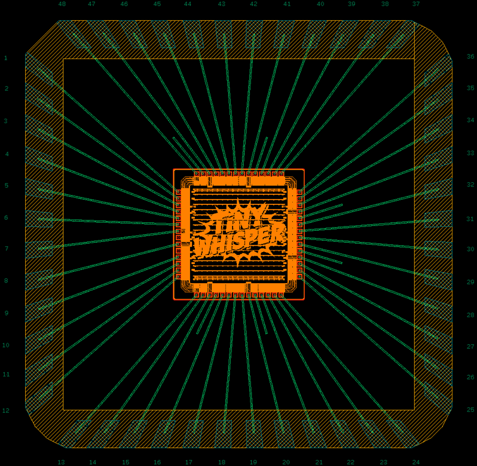

# Packaging

- SERMA: https://www.serma-microelectronics.com/en/


## Useful Links

- Plastic Open-Pak Packages, Open-molded Plastic Package (OmPP): https://www.qptechnologies.com/products/ompp/
- EUROPRACTICE - ASIC Packaging - Overview: https://europractice-ic.com/services/packaging/asic-packaging/
- EUROPRACTICE - ASIC Packaging - DRC: https://europractice-ic.com/wp-content/uploads/2020/06/ASIC_Prototype_Packaging_Design_Rules_2024.pdf
- EUROPRACTICE - ASIC Packaging - QFN-48: https://europractice-ic.com/wp-content/uploads/2019/06/MLP7X7-48-OP-02-R2-ECN-10501.pdf
- EUROPRACTICE - ASIC Packaging - GDS: https://europractice-ic.com/wp-content/uploads/2019/07/EP_PACKAGES_08022018.gds_.gz
- Take the DXF file from here: https://www.mirrorsemi.com/OpenChip.html and use https://www.artwork.com/gdsii/asm3500/windows/interface.htm to get the GDS file.


## Automated Bondplan Generation

The bondplan is generated by [run_bondplan.py](run_bondplan.py), driven by
[config.yaml](config.yaml) (structured like a LibreLane `config.yaml`:
flat `UPPER_CASE` keys, `dir::` paths relative to the config file, placement
as `location` / `orientation`).

Run inside the IIC-OSIC-TOOLS container:

```bash
cd packaging
python3 run_bondplan.py config.yaml
# or: klayout -b -r run_bondplan.py -rd config=config.yaml
```

The flow:

1. extracts `Passiv` (9/0), `TopVia2` (133/0) and `TopMetal2` (134/0) from
   the top-level die GDS into `DIE_EXTRACT_GDS`,
2. places the extracted die into the package (`DIE_PLACEMENT.location` is
   the die lower-left corner relative to the lower-left corner of the
   package inner border, i.e. the square touching the lead tips),
3. detects the die bondpads (`Passiv` openings) and their names
   (`TopMetal2.text` labels), and the package leads / pin numbers from the
   package GDS,
4. draws the bondwires defined by `PINOUT` (pin number -> pad name, `EPAD`
   entries become exposed-pad downbonds) on `Exchange0.drawing` (190/0),
   with a bond table on `Exchange0.text` (190/25) next to the plan,
5. checks wire lengths, crossings and wire-to-wire spacing,
6. writes the bondplan GDS, a CSV bond table, and PNG/SVG images
   (`*_white` / `*_black` variants, following `ihp130/scripts/lay2img.py`).

Generated outputs: `tinywhisper_bondplan.gds` / `.csv` /
`_white.png` / `_black.png` / `_white.svg` / `_black.svg`.

## Bonding Diagram

<p align="center">
  <a href="../doc/fig/tinywhisper_bondplan.png">
    
  </a>
  <br>
  <em>Bonding diagram of the ihp-sg13cmos TinyWhisper ASIC.</em>
</p>