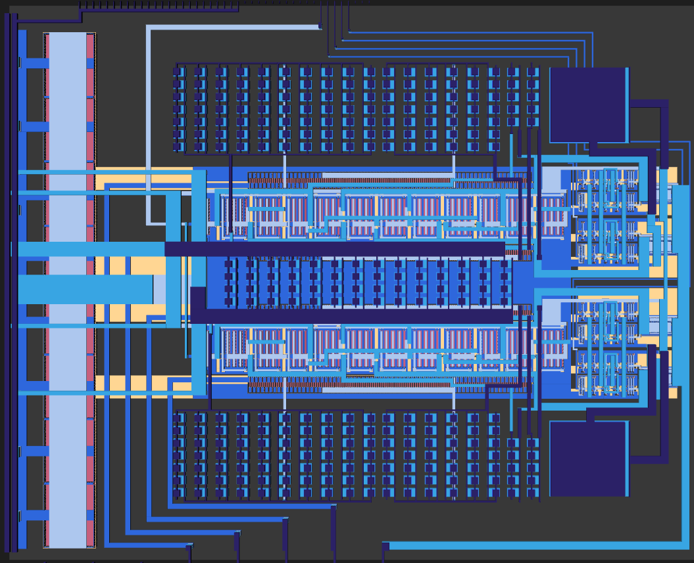

# sky130A TinyWhisper

> [!WARNING]
> This repository is a heavy work in progress and partially outdated. Please refer to the ihp-sg13g2 version.

> [!IMPORTANT]
> This repository requires the [IIC-OSIC-TOOLS](https://github.com/iic-jku/IIC-OSIC-TOOLS) container with tag `2026.04` or later.


## Directory Structure

```text
📁 sky130/
├─ 📁 macros/
│  ├─ 📁 archive/
│  │  └─ 📁 verilog_TT_11-2025/
│  │     ├─ 📁 src/
│  │     │  └─ lo_gen.v
│  │     ├─ 📁 tb/
│  │     │  ├─ 📁 data/
│  │     │  ├─ 📁 matlab/
│  │     │  │  ├─ dec2frac.m
│  │     │  │  ├─ getCordicScaling.m
│  │     │  │  ├─ getRotationAngles.m
│  │     │  │  ├─ sfixed_qa.m
│  │     │  │  ├─ unsigned2bin.m
│  │     │  │  └─ write_std_definitions.m
│  │     │  ├─ cordic_iterative_tb.v
│  │     │  ├─ dsmod_tb.v
│  │     │  └─ lo_gen_tb.v
│  │     └─ Makefile
│  ├─ 📁 iqmod/
│  │  ├─ 📁 doc/
│  │  │  ├─ TinyWhisper_SKY130.pdf
│  │  │  ├─ TinyWhisper_SKY130.pptx
│  │  │  ├─ info.yaml
│  │  │  ├─ magic_cheatsheet.pdf
│  │  │  └─ wspr_tx_iqmod_mfb_lpf_floorplan.pdf
│  │  ├─ 📁 layout/
│  │  │  └─ *.mag
│  │  ├─ 📁 netlist/
│  │  │  ├─ 📁 layout/
│  │  │  ├─ 📁 pex/
│  │  │  │  └─ reorder_spice_pins.py
│  │  │  └─ 📁 schematic/
│  │  ├─ 📁 release/
│  │  │  └─ 📁 v.1.0.0/
│  │  │     ├─ 📁 gds/
│  │  │     │  └─ tt_um_TinyWhisper.gds
│  │  │     ├─ 📁 lef/
│  │  │     │  └─ tt_um_TinyWhisper.lef
│  │  │     └─ ReleaseNote.md
│  │  ├─ 📁 render/
│  │  │  ├─ 📁 blender/
│  │  │  └─ 📁 img/
│  │  │     └─ wspr_tx_iqmod_top.png
│  │  ├─ 📁 schematic/
│  │  │  ├─ *.sch
│  │  │  ├─ *.sym
│  │  │  └─ xschemrc
│  │  ├─ 📁 scripts/
│  │  │  ├─ 📁 filter_designer/
│  │  │  │  ├─ 📁 figures/
│  │  │  │  ├─ 3rd_order_mfb_lpf_designer.mcdx
│  │  │  │  ├─ 3rd_order_mfb_lpf_designer.py
│  │  │  │  └─ biquad_mfb_lpf_designer.py
│  │  │  ├─ 📁 plot_simulations/
│  │  │  │  ├─ 📁 data/
│  │  │  │  ├─ 📁 figures/
│  │  │  │  ├─ ngspice2python.py
│  │  │  │  ├─ plot_amplifier.py
│  │  │  │  └─ plot_template.py
│  │  │  ├─ 📁 pwm_generator/
│  │  │  │  ├─ 📁 data/
│  │  │  │  └─ pwm_generator.py
│  │  │  └─ lay2img.py
│  │  ├─ 📁 testbenches/
│  │  │  ├─ *.sch
│  │  │  └─ xschemrc
│  │  └─ 📁 verification/
│  │     ├─ 📁 cace/
│  │     │  ├─ 📁 results/
│  │     │  ├─ 📁 scripts/
│  │     │  ├─ 📁 templates/
│  │     │  ├─ wspr_tx_iqmod_mfb_lpf.yaml
│  │     │  └─ wspr_tx_iqmod_mfb_lpf_ota_core.yaml
│  │     ├─ 📁 drc/
│  │     └─ 📁 lvs/
│  └─ 📁 riscv/
│     ├─ 📁 flow/
│     │  └─ 📁 librelane/
│     │     ├─ config.yaml
│     │     ├─ impl.sdc
│     │     ├─ pin_order.cfg
│     │     └─ signoff.sdc
│     ├─ 📁 rtl/
│     │  ├─ 📁 matlab/
│     │  │  ├─ dec2frac.m
│     │  │  ├─ getCordicScaling.m
│     │  │  ├─ getRotationAngles.m
│     │  │  ├─ iterative_cordic_main.m
│     │  │  ├─ sfixed_qa.m
│     │  │  └─ unsigned2bin.m
│     │  ├─ alu.sv
│     │  ├─ constants.sv
│     │  ├─ control.sv
│     │  ├─ cordic_iterative.v
│     │  ├─ cordic_slice.v
│     │  ├─ csr.sv
│     │  ├─ dsmod.v
│     │  ├─ freq_generator.sv
│     │  ├─ i2c_master.sv
│     │  ├─ imm_gen.sv
│     │  ├─ instructioncounter.sv
│     │  ├─ lo_gen.v
│     │  ├─ memory.sv
│     │  ├─ regs.sv
│     │  ├─ spi_master.sv
│     │  ├─ sram_sim.sv
│     │  ├─ tinywhisper_riscv.sv
│     │  ├─ uart_rx.v
│     │  └─ uart_tx.v
│     └─ 📁 testbenches/
│        ├─ 📁 cocotb/
│        │  └─ chip_top_tb.py
│        └─ 📁 verilog/
│           ├─ dsmod_tb.v
│           └─ tinywhisper_riscv_tb.sv
└─ README.md
```


## IQ Modulator (sky130A)

The `macros/iqmod` folder contains the IQ modulator analog front-end designed in the sky130A PDK using `Xschem` and `Ngspice`. The layout was created with `Magic`.

<p align="center">
  <a href="macros/iqmod/render/img/wspr_tx_iqmod_top.png">
    
  </a>
  <br>
  <em>Render of the sky130A IQ modulator layout.</em>
</p>

### CACE Simulations

Process variation and mismatch simulations are configured through the YAML files in `verification/cace/`:

- `wspr_tx_iqmod_mfb_lpf.yaml` — characterization of the 3rd-order MFB low-pass filter
- `wspr_tx_iqmod_mfb_lpf_ota_core.yaml` — characterization of the inverter-based OTA core

Result plots are saved to `verification/cace/results/`.


## Archive — Verilog Tiny Tapeout (November 2025)

The `macros/archive/verilog_TT_11-2025` folder contains the earlier hardware-only WSPR implementation submitted to the SKY130 [Tiny Tapeout MPW](https://tinytapeout.com/chips/ttsky25b/tt_um_cejmu_wspr) run in November 2025. This design implemented the full WSPR encoding pipeline in digital logic without a RISC-V CPU.

To run the Verilog RTL simulations using [Icarus Verilog](https://github.com/steveicarus/iverilog), enter the archive directory and use:

```sh
make simulation
```

Individual targets are also available:

```sh
make sim_callsign       # Simulate callsign encoder
make sim_locator        # Simulate locator / power encoder
make sim_fec            # Simulate convolutional FEC encoder
make sim_interleave     # Simulate interleaver
make sim_sync           # Simulate sync word insertion
make sim_wspr_encoding  # Simulate complete WSPR encoding chain
make sim_toplevel_slim  # Simulate trimmed top-level (digital + analog)
make sim_toplevel_full  # Simulate full top-level
```


## RISC-V CPU (sky130A)

The `macros/riscv` folder contains the RISC-V CPU RTL and the LibreLane configuration for the sky130A PDK. The LibreLane flow configuration is located in `flow/librelane/`.
